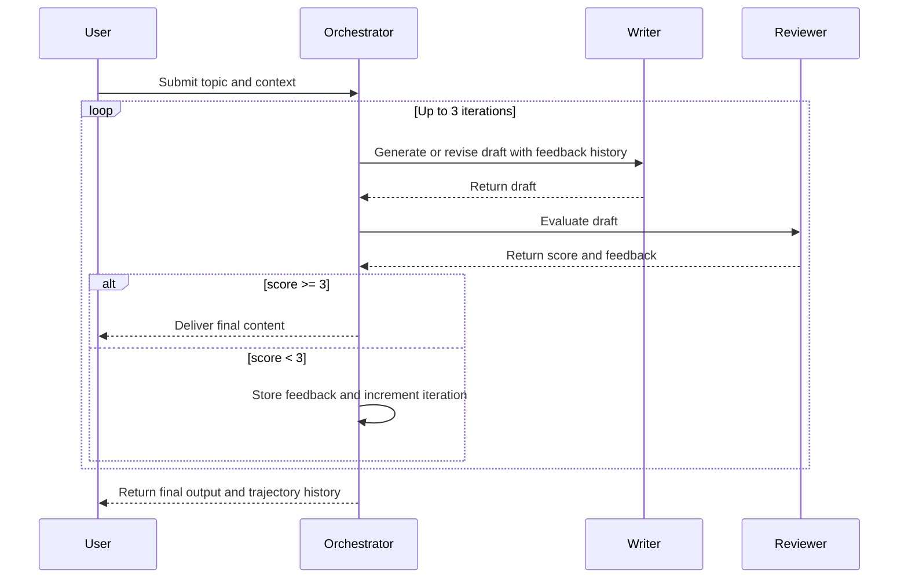

# TALK2DATA_AIAGENT

**An Intelligent Multi-Agent AI Content Generation Engine with Automated Review & Refinement**

---

## 📋 Overview

**TALK2DATA_AIAGENT** is a sophisticated, production-grade AI-powered content generation system built on the **Writer-Critic (Generator-Evaluator) design pattern**. The system orchestrates cooperative agents that leverage the **Bosch LLM Farm API** (Azure OpenAI endpoints) to collaboratively write and iteratively refine high-quality articles.

The architecture implements a closed-loop feedback system where:
- The **Writer Agent** generates or revises content based on user input and historical feedback
- The **Reviewer Agent** evaluates drafts with intelligent scoring and constructive feedback
- The **Orchestrator Agent** manages state and drives the iterative refinement process
- A **Streamlit Web Interface** provides real-time visibility into the collaborative loop

**Ideal for:** Automated content generation, multi-stage quality assurance workflows, AI-powered editorial systems, and demonstrating cooperative agent patterns in production environments.

---

## ✨ Key Features

- **🤝 Cooperative Multi-Agent Architecture**: Writer and Reviewer agents collaborate in a structured loop, each with specialized roles
- **🔁 Iterative Refinement Loop**: Up to 3 intelligent iterations with trajectory state tracking to ensure continuous improvement
- **💾 Trajectory State Memory**: Complete history of each iteration—scores, feedback, and draft versions—enabling context-aware revisions
- **🛡️ Defensive JSON Parsing**: Robust error handling and safe extraction of LLM responses, gracefully managing format inconsistencies
- **📊 Intelligent Scoring System**: Automated 1-5 scale evaluation with exit conditions (score ≥ 3 triggers completion)
- **🎨 Beautiful Web Interface**: Real-time Streamlit dashboard showcasing agent collaboration, progress tracking, and final output
- **🔐 Secure Configuration**: Environment-based API key management with strict `.gitignore` to prevent credential leakage
- **⚡ Enterprise LLM Integration**: Direct integration with Bosch LLM Farm API and Azure OpenAI endpoints

---

## 🏗️ System Architecture

### Agent Collaboration Sequence



### Data Flow Overview

```
User Input (Topic)
    ↓
Orchestrator (Initialization)
    ↓
Writer Agent (Draft Generation)
    ↓
Reviewer Agent (Scoring & Feedback)
    ↓
Orchestrator (Trajectory Update)
    ↓
Decision Gate
├─ Score ≥ 3 → Deliver Output ✅
└─ Score < 3 → Writer Agent (Revision) 🔄
```

---

## 📁 Project Directory Structure

```
Talk2Data_AIAgent/
│
├── agent_orchestrator.py       # 🎯 Orchestrator Agent
│                                  # Manages state machine loop, trajectory tracking
│                                  # Controls iteration flow (max 3 iterations)
│
├── agent_writer.py             # ✍️ Writer Agent
│                                  # Generates initial drafts
│                                  # Revises content based on feedback history
│                                  # Integrates with Bosch LLM Farm API
│
├── agent_reviewer.py           # 👁️ Reviewer Agent
│                                  # Evaluates draft quality (1-5 scale)
│                                  # Extracts JSON with defensive parsing
│                                  # Returns {score, feedback} structure
│
├── app.py                      # 🎨 Streamlit Web Interface
│                                  # Real-time agent collaboration visualization
│                                  # Progress tracking and state monitoring
│                                  # Beautiful UI for end-users
│
├── agent_test.py               # 🧪 Testing & Validation
│                                  # Unit tests for agent behavior
│                                  # Integration test scenarios
│
├── requirements.txt            # 📦 Python Dependencies
│                                  # LangChain, LangGraph, Streamlit, etc.
│
├── .env.example                # 🔑 Environment Variables Template
│                                  # Copy to .env and fill with your API key
│
├── .gitignore                  # 🔒 Security Configuration
│                                  # Prevents .env, __pycache__, venv from Git
│
└── README.md                   # 📖 This File

```

---

## 🚀 Getting Started

### Prerequisites

- **Python 3.11** or higher
- **Anaconda** or **Miniconda** (recommended for dependency management)
- **Bosch LLM Farm API Key** (contact your Bosch AI team for access)
- **Internet connectivity** with Bosch proxy configuration

### Step 1: Clone or Download the Project

```bash
cd Desktop
# If cloning from Git:
git clone <repository-url> Talk2Data_AIAgent
cd Talk2Data_AIAgent
```

### Step 2: Create and Activate Anaconda Environment

```bash
# Create a new Anaconda environment with Python 3.11
conda create --name talk2data python=3.11

# Activate the environment
conda activate talk2data
```

### Step 3: Configure Bosch Proxy Settings (If Required)

For users behind a Bosch corporate proxy, configure the environment before installing dependencies:

**Windows (PowerShell):**
```powershell
$env:HTTP_PROXY = "http://proxy.bosch.com:8080"
$env:HTTPS_PROXY = "http://proxy.bosch.com:8080"
```

**Linux/macOS:**
```bash
export HTTP_PROXY=http://proxy.bosch.com:8080
export HTTPS_PROXY=http://proxy.bosch.com:8080
```

### Step 4: Install Dependencies

```bash
pip install -r requirements.txt
```

**Dependencies Summary:**
- `langgraph` – Multi-agent orchestration
- `langchain` + `langchain-core` – LLM framework
- `langchain-openai` – OpenAI/Azure integration
- `streamlit` – Web UI framework
- `python-dotenv` – Secure environment variable management
- `requests` – HTTP client for API calls

### Step 5: Configure Environment Variables

1. **Create a `.env` file** in the project root:

```bash
# Windows
copy .env.example .env

# Linux/macOS
cp .env.example .env
```

2. **Edit `.env`** and add your Bosch LLM Farm API key:

```env
# .env
LLM_FARM_API_KEY=your_actual_api_key_here
```

⚠️ **Security Note:** Never commit `.env` to version control. The `.gitignore` file already excludes it.

### Step 6: Verify Installation

```bash
# Test Python environment
python --version  # Should show Python 3.11.x

# Verify dependencies
pip list | findstr "langchain streamlit"
```

---

## 🎯 How to Run

### Option 1: Run the Orchestrator in Terminal (CLI Mode)

For programmatic or batch processing:

```bash
python agent_orchestrator.py
```

**Input Example:**
```
Enter your topic: "How to build a scalable microservices architecture"
```

**Output:**
- Iteration-by-iteration progress
- Final draft content
- Reviewer scores and feedback
- Complete trajectory history

---

### Option 2: Run the Streamlit Web Interface (Recommended)

For interactive exploration with a beautiful UI:

```bash
streamlit run app.py
```

**What You'll See:**
- 📊 Real-time progress tracking
- ✍️ Live draft generation status
- 👁️ Reviewer feedback and scores
- 🔄 Iteration history visualization
- 📄 Final polished content

The app will launch at `http://localhost:8501` in your default browser.

---

## 📖 Workflow Example

### Scenario: Generate a Technical Article

1. **User Input:** "Explain the advantages of containerization in DevOps"

2. **Iteration 1:**
   - Writer generates initial draft
   - Reviewer scores: **2.0/5.0** ("Good concepts, needs more depth")
   - Feedback: "Add real-world examples and performance metrics"

3. **Iteration 2:**
   - Writer revises draft with feedback
   - Reviewer scores: **3.5/5.0** ("Well-structured, excellent examples")
   - Exit condition met (score ≥ 3) ✅

4. **Output:** Polished article with complete iteration history

---

## 🔧 Configuration Reference

### Orchestrator Parameters

| Parameter | Default | Description |
|-----------|---------|-------------|
| `max_iterations` | 3 | Maximum refinement loops allowed |
| `score_threshold` | 3 | Minimum score to exit and deliver content |
| `score_scale` | 1–5 | Reviewer evaluation scale |

### Environment Variables

| Variable | Required | Description |
|----------|----------|-------------|
| `LLM_FARM_API_KEY` | ✅ Yes | Bosch LLM Farm API authentication key |
| `HTTP_PROXY` | ❌ No | Corporate proxy URL (if behind proxy) |
| `HTTPS_PROXY` | ❌ No | Corporate proxy URL (if behind proxy) |

---

## 🔐 Security Best Practices

✅ **What We Do:**
- Store sensitive API keys in `.env` (never in code)
- Exclude `.env` via `.gitignore`
- Exclude `__pycache__/`, `*.pyc`, virtual environments from version control
- Validate and sanitize LLM responses

✅ **What You Should Do:**
- Never share your `.env` file or API keys
- Rotate API keys regularly
- Review `.gitignore` before first commit
- Use HTTPS for all API communications

---

## 🧪 Testing & Validation

### Run Unit Tests

```bash
python agent_test.py
```

### Manual Testing Scenarios

1. **Test Writer Generation:**
   ```bash
   python -c "from agent_writer import write_content; write_content('test topic', '', [], 'YOUR_API_KEY')"
   ```

2. **Test Reviewer Parsing:**
   ```bash
   python -c "from agent_reviewer import review_content; review_content('test draft', 'test topic', 'YOUR_API_KEY')"
   ```

---

## 📊 Architecture Highlights

### 1. **State Management (Trajectory Tracking)**
- Every iteration stores: `{iteration, score, feedback, timestamp, draft_version}`
- Full history available for debugging and analysis
- Enables intelligent context feeding to Writer

### 2. **Defensive JSON Extraction**
- Handles LLM format inconsistencies gracefully
- Extracts `{score, feedback}` even with malformed responses
- Prevents crashes on parsing errors

### 3. **Iterative Loop Control**
- Automatic exit on score ≥ 3 (quality gate)
- Maximum 3 iterations prevents runaway loops
- Transparent tracking of all iterations

### 4. **Enterprise Integration**
- Direct Bosch LLM Farm API integration
- Azure OpenAI deployment support
- Proxy-aware for corporate networks

---

## 🚨 Troubleshooting

### Issue: `LLM_FARM_API_KEY not found`
**Solution:** Ensure `.env` file exists in project root with valid API key
```bash
cat .env  # Verify file contents (don't commit this output)
```

### Issue: Proxy connection errors
**Solution:** Configure HTTP/HTTPS proxy environment variables
```bash
$env:HTTP_PROXY = "http://proxy.bosch.com:8080"
```

### Issue: Module import errors
**Solution:** Ensure conda environment is active and dependencies installed
```bash
conda activate talk2data
pip install -r requirements.txt
```

### Issue: Streamlit port already in use
**Solution:** Run on alternative port
```bash
streamlit run app.py --server.port 8502
```

---

## 📚 Technical Stack

| Component | Technology | Purpose |
|-----------|-----------|---------|
| **Orchestration** | LangGraph | Multi-agent state management |
| **LLM Framework** | LangChain | Unified API for LLM interactions |
| **LLM Provider** | Bosch LLM Farm (Azure OpenAI) | Inference engine |
| **Web UI** | Streamlit | Interactive dashboard |
| **Config Management** | python-dotenv | Environment variables |
| **HTTP Client** | requests | API communication |
| **Testing** | unittest / pytest | Quality assurance |

---

## 📝 Development Notes

### Adding New Agents
1. Create `agent_[name].py` in project root
2. Implement core logic with API integration
3. Add integration point in `agent_orchestrator.py`
4. Update `requirements.txt` if new dependencies needed

### Extending Feedback Loop
- Modify `feedback_history` structure in orchestrator
- Enhance Writer's context injection logic
- Add new evaluation criteria in Reviewer

### Performance Optimization
- Cache LLM responses for identical prompts
- Implement async/concurrent agent calls
- Add database persistence for trajectory history

---

## 📄 License & Attribution

This project is built with enterprise-grade components:
- **LangChain** – Open source LLM framework
- **LangGraph** – Multi-agent orchestration
- **Streamlit** – Open source data app framework
- **Bosch LLM Farm** – Enterprise LLM infrastructure

---

## 🤝 Contributing

For improvements or bug reports:
1. Test thoroughly in your environment
2. Document changes clearly
3. Ensure `.env` is never committed
4. Submit pull requests with comprehensive descriptions

---

## 📞 Support & Questions

For issues or questions:
- **Internal Wiki**: [Bosch AI Documentation]
- **API Support**: [Bosch LLM Farm Team]
- **LangChain Docs**: https://python.langchain.com
- **Streamlit Docs**: https://docs.streamlit.io

---

**Built with precision. Refined iteratively. Delivered intelligently.** ✨

---

*Last Updated: 2026-07-25*  
*Version: 1.0.0*
